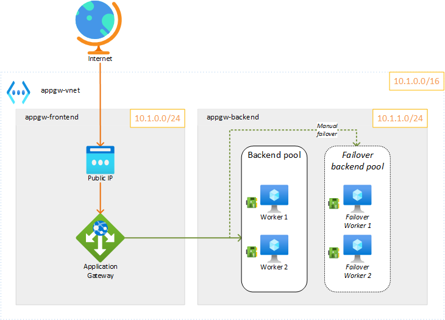

# Application gateway - simple HTTP backend

The goal of this quick lab setup is to deploy an Azure Application Gateway with a simple HTTP backend displaying some data about the used worker (hostname, IP, etc).



The deployment of the *failover backend pool* is optional and can be used to setup a manual failover scenario.

In this lab, the application gateway is made with the following sub-components:



## Deploy

This terraform template will deploy:

* 1 application gateway with a public frontend IP address
* `X` backend workers based on `web_workers_count` configuration (2 by default)
* `X` backend workers for manual failback testing, based on `failback_workers_count` configuration (0 by default)

### Configure

Edit the `terraform.tfvars` file and set (at least) the following variables:

```tf
main_region       = "westeurope"
subscription_name = "to-be-changed"
subscription_id   = "to-be-changed
```

### Deploy

```bash
terraform init
terraform apply # approve
```

### See ouputs

```bash
terraform output
# Outputs:
testing_command = "curl -s http://xxx.xxx.xxx.xxx/api | python3 -m json.tool"
```

## Results

You should now be able to test the deployment by using the command provided in the output:

```bash
curl -s http://xxx.xxx.xxx.xxx/api | python3 -m json.tool
```

You should get an ouptut like this:

```json
{
  "X-Forwarded-For": "xxx.xxx.xxx.xxx:58776",
  "architecture": "x86_64",
  "hostname": "web-2",
  "ip-address": "10.1.1.6",
  "mac-address": "1d:88:0f:2c:28:59",
  "platform": "Linux",
  "platform-release": "5.15.0-1017-azure",
  "platform-version": "#20-Ubuntu SMP Fri Aug 5 12:00:24 UTC 2022",
  "processor": "x86_64",
  "ram": "1 GB",
  "remote_addr": "10.1.0.7",
  "uptime": "178 seconds"
}
```

You can also check the health of the backend workers by running the following command:

```bash
az network application-gateway show-backend-health --resource-group appgw-test-RG --name AppGateway \
  | jq ".backendAddressPools[0].backendHttpSettingsCollection[0].servers[] | {address: .address, health: .health, healthProbeLog: .healthProbeLog}"
```

You should get an ouptut like this:

```json
{
  "address": "10.1.1.4",
  "health": "Healthy",
  "healthProbeLog": "Success. Received 301 status code"
}
{
  "address": "10.1.1.6",
  "health": "Healthy",
  "healthProbeLog": "Success. Received 301 status code"
}
```

## Failback

To test a manual failback on a new backend pool, you can edit the file `app-gw.tf` and change the `request_routing_rule` configuration to link the failback backend pool:

```tf
resource "azurerm_application_gateway" "appgw" {
  ...
   request_routing_rule {
    priority                  = 1
    name                      = var.request_routing_rule_name
    rule_type                 = "Basic"
    http_listener_name        = var.http_listener_name
    # backend_address_pool_name = var.backend_address_pool_name
    backend_address_pool_name  = "${var.backend_address_pool_name}-failback"
    backend_http_settings_name = var.backend_http_settings_name
  }
```

> You need to have `failback_workers_count` > 0 to test this.

You can apply the change by running the following command:

```bash
terraform apply
```

And test if the hostname of failback worker nodes is well shown when using the API of the demo service:

```bash
curl -s http://xxx.xxx.xxx.xxx/api | python3 -m json.tool
```

You should get an ouptut like this:

```json
{
  "X-Forwarded-For": "xxx.xxx.xxx.xxx:58846",
  "architecture": "x86_64",
  "hostname": "web-1-failback",
  "ip-address": "10.1.1.5",
  "mac-address": "8f:5a:87:38:0e:94",
  "platform": "Linux",
  "platform-release": "5.15.0-1017-azure",
  "platform-version": "#20-Ubuntu SMP Fri Aug 5 12:00:24 UTC 2022",
  "processor": "x86_64",
  "ram": "1 GB",
  "remote_addr": "10.1.0.7",
  "uptime": "117 seconds"
}
```

> In the above example, the hostname of the responding worker is `web-1-failback`, meaning that the used worker is one of the *failover backend pool*.

## Cleanup

```bash
terraform destroy
```
