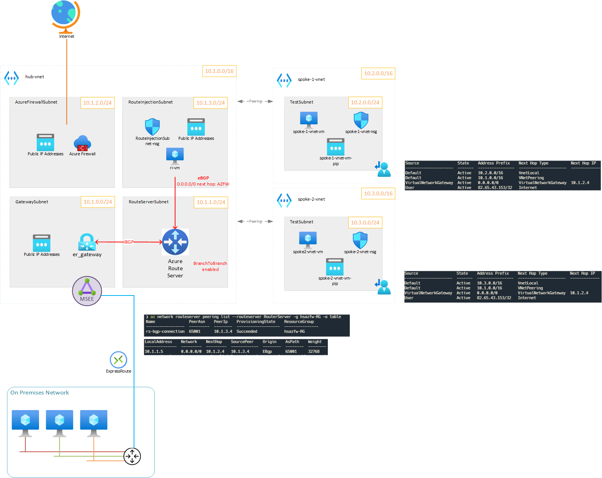

# Default route injection to promote Azure Firewall as next hop

This set of azure resources was used to illustrate a route injection scenario for Azure VMware Solution to use Azure Firewall as its next hop.

> The original idea comes from @erjosito who mentioned this route injection method in this blog post: [Azure Firewall’s sidekick to join the BGP superheroes](https://blog.cloudtrooper.net/2022/05/02/azure-firewalls-sidekick-to-join-the-bgp-superheroes/)

## Problem

In a Hub and Spoke architecture, Azure Firewall is an elegant way to protect communications between the two Azure Virtual Networks.
The same concept could be useful once applied to Azure VMware Solution.

In order to redirect all the outbound traffic from AVS, a default route (0.0.0.0/0) needs to be advertised to AVS.

Azure Firewall does not support BGP and cannot be used to announce a default route to AVS, even using Azure Route Server.
Neither it is possible to use User Defined Route (UDR) on the *GatewaySubnet* to inject this route going through the Azure Firewall.

## Suggested solution

As the missing component is the route injection in the Azure Route Server, the following solution was proposed:

* Deploying a VM with BGP announcement capabilities (Linux VM with [Bird](https://bird.network.cz/) service)
* Announce the default route (0.0.0.0/0) using the IP address of Azure Firewall as the next hop



## Deploy

This terraform template was used to deploy a MVP of the above solution with:

* 2 spokes vnet and VMs in a TestSubnet
* 1 hub vnet with:
  * 1 Express Route gateway
  * 1 Azure Route Server
  * 1 Azure Firewall
  * 1 Route injection VM (Linux VM with [Bird](https://bird.network.cz/) service)

### Configure

Edit the `terraform.tfvars` file and set (at least) the following variables:

```tf
main_region       = "westeurope"
subscription_name = "to-be-changed"
subscription_id   = "to-be-changed

# Bypass Azure Firewall route to VM when incoming from this specific IP
# (testing purposes only): set it according to your current public IP address.
my_ip = "1.1.1.1"
```

### Deploy

```bash
terraform init
terraform apply # approve
```

### See ouputs

```bash
terraform output
# Outputs:
ri-connect = "ssh azureuser@51.124.208.213"
ri-pip = "51.124.208.213"
vm1-connect = "ssh azureuser@20.160.20.253"
vm1-pip = "20.160.20.253"
vm1-routes-cmd = "az network nic show-effective-route-table -o table --ids /subscriptions/********/resourceGroups/hsazfw-RG/providers/Microsoft.Network/networkInterfaces/spoke-1-vnet-vm-nic"
vm2-connect = "ssh azureuser@20.160.20.151"
vm2-pip = "20.160.20.151"
vm2-routes-cmd = "az network nic show-effective-route-table -o table --ids /subscriptions/********/resourceGroups/hsazfw-RG/providers/Microsoft.Network/networkInterfaces/spoke-2-vnet-vm-nic"
```

## Results

### RouteServer

List RouteServer peers:

```bash
az network routeserver peering list-learned-routes -n rs-bgp-connection --routeserver RouterServer -g hsazfw-RG  -o table
# Output:
Name               PeerAsn    PeerIp    ProvisioningState    ResourceGroup
-----------------  ---------  --------  -------------------  ---------------
rs-bgp-connection  65001      10.1.3.4  Succeeded            hsazfw-RG
```

List RouteServer routes:

```bash
az network routeserver peering list-learned-routes -n rs-bgp-connection --routeserver RouterServer -g hsazfw-RG --query 'RouteServiceRole_IN_0' -o table
# Output:
LocalAddress    Network    NextHop    SourcePeer    Origin    AsPath    Weight
--------------  ---------  ---------  ------------  --------  --------  --------
10.1.1.5        0.0.0.0/0  10.1.2.4   10.1.3.4      EBgp      65001     32768
```

The default route (`0.0.0.0/0`) is advertised to the RouteServer via the Azure Firewall (`10.1.2.4`). Route injection seems to work.

### Route injection server

List routes:

```bash
sudo birdc show route
# Output:
BIRD 1.6.8 ready.
0.0.0.0/0          via 10.1.3.4 on eth0 [static1 14:54:14] * (200)
10.2.0.0/16        unreachable [rs0 15:07:50 from 10.1.1.4] * (100/-) [AS65515i]
                   unreachable [rs1 15:07:47 from 10.1.1.5] (100/-) [AS65515i]
10.3.0.0/16        unreachable [rs0 15:07:09 from 10.1.1.4] * (100/-) [AS65515i]
                   unreachable [rs1 15:07:11 from 10.1.1.5] (100/-) [AS65515i]
10.1.0.0/16        unreachable [rs0 15:01:20 from 10.1.1.4] * (100/-) [AS65515i]
                   unreachable [rs1 15:01:19 from 10.1.1.5] (100/-) [AS65515i]
```

> You can safely ignore the `unreachable` routes.

List Peers

```bash
sudo birdc show protocols
# Output:
BIRD 1.6.8 ready.
name     proto    table    state  since       info
device1  Device   master   up     14:54:14
direct1  Direct   master   down   14:54:14
kernel1  Kernel   master   up     14:54:14
static1  Static   master   up     14:54:14
rs0      BGP      master   up     15:01:19    Established
rs1      BGP      master   up     15:01:18    Established
```

### Test VMs

List effective routes:

```bash
az network nic show-effective-route-table --ids /subscriptions/********/resourceGroups/hsazfw-RG/providers/Microsoft.Network/networkInterfaces/spoke-1-vnet-vm-nic -o table
# Output:
Source                 State    Address Prefix    Next Hop Type          Next Hop IP
---------------------  -------  ----------------  ---------------------  -------------
Default                Active   10.2.0.0/16       VnetLocal
Default                Active   10.1.0.0/16       VNetPeering
VirtualNetworkGateway  Active   0.0.0.0/0         VirtualNetworkGateway  10.1.2.4
User                   Active   1.1.1.1/32        Internet
```

Ping VM in another vNETs

```bash
ping -c 2 10.3.0.4
# Output:
PING 10.3.0.4 (10.3.0.4) 56(84) bytes of data.
64 bytes from 10.3.0.4: icmp_seq=1 ttl=64 time=0.877 ms
64 bytes from 10.3.0.4: icmp_seq=2 ttl=64 time=0.755 ms
```

## Cleanup

```bash
terraform destroy
```
