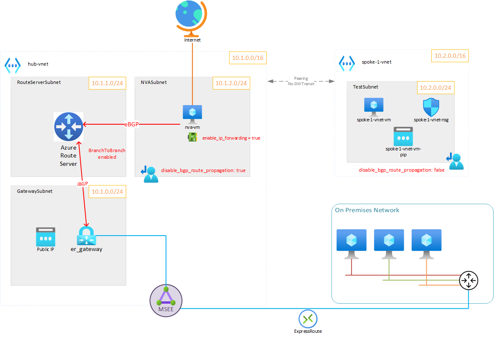

#



## Deploy

This terraform template was used to deploy a MVP of the above solution with:

* 1 spoke vnet with:
  * VM in a `TestSubnet`
* 1 hub vnet with:
  * 1 Express Route gateway
  * 1 Azure Route Server
  * 1 Linux based NVA VM (Linux VM with [Bird](https://bird.network.cz/) service and `iptables`)

VMs are configured with:

* A public IP address
* SSH listening on port 2222 (for compliance reasons)
* and, when suitable, a direct route to the IP address specified by the deployer (UDR with a /32 prefix) to bypass other routing preferences and provide a non affected direct route to the VM.

### Configure

Edit the `terraform.tfvars` file and set (at least) the following variables:

```tf
main_region       = "westeurope"
subscription_name = "to-be-changed"
subscription_id   = "to-be-changed

# Bypass Azure Firewall route to VM when incoming from this specific IP
# (testing purposes only): set it according to your current public IP address.
my_ip = "1.1.1.1"
```

### Deploy

```bash
terraform init
terraform apply # approve
```

### See ouputs

```bash
terraform output
# Outputs:
nva-connect = "ssh -p2222 azureuser@20.229.87.171"
nva-pip = "20.229.87.171"
vm1-connect = "ssh -p2222 azureuser@20.229.87.240"
vm1-pip = "20.229.87.240"
```

## Results

### RouteServer

List RouteServer peers:

```bash
az network routeserver peering list --routeserver RouterServer -g nva-testing-RG -o table
# Output:
Name               PeerAsn    PeerIp    ProvisioningState    ResourceGroup
-----------------  ---------  --------  -------------------  ---------------
rs-bgp-connection  65001      10.1.2.4  Succeeded            nva-testing-RG
```

The NVA BGP daemon (*bird*) is well peered with the Azure Route Server.

List RouteServer learned routes:

```bash
az network routeserver peering list-learned-routes -n rs-bgp-connection --routeserver RouterServer -g nva-testing-RG --query 'RouteServiceRole_IN_0' -o table
# Outputs:
LocalAddress    Network      NextHop    SourcePeer    Origin    AsPath    Weight
--------------  -----------  ---------  ------------  --------  --------  --------
10.1.1.5        0.0.0.0/0    10.1.2.4   10.1.2.4      EBgp      65001     32768
10.1.1.5        10.1.2.0/24  10.1.2.4   10.1.2.4      EBgp      65001     32768
```

The default route (`0.0.0.0/0`) is advertised to the RouteServer via the newly deployed NVA (`10.1.2.4`).

### NVA

List routes:

```bash
sudo birdc show route
# Output:
BIRD 1.6.8 ready.
0.0.0.0/0          via 10.1.2.1 on eth0 [static1 10:18:43] * (200)
10.2.0.0/16        unreachable [rs0 10:18:48 from 10.1.1.4] * (100/-) [AS65515i]
                   unreachable [rs1 10:18:47 from 10.1.1.5] (100/-) [AS65515i]
10.1.2.0/24        dev eth0 [direct1 10:18:43] * (240)
10.1.0.0/16        unreachable [rs0 10:18:48 from 10.1.1.4] * (100/-) [AS65515i]
                   unreachable [rs1 10:18:47 from 10.1.1.5] (100/-) [AS65515i]
```

> You can safely ignore the `unreachable` routes.

List Peers

```bash
sudo birdc show protocols
# Output:
BIRD 1.6.8 ready.
name     proto    table    state  since       info
device1  Device   master   up     10:18:43
direct1  Direct   master   up     10:18:43
kernel1  Kernel   master   up     10:18:43
static1  Static   master   up     10:18:43
rs0      BGP      master   up     10:18:48    Established
rs1      BGP      master   up     10:18:47    Established
```

### Test VM

List effective routes:

```bash
az network nic show-effective-route-table --ids /subscriptions/********/resourceGroups/nva-testing-RG/providers/Microsoft.Network/networkInterfaces/spoke-1-vnet-vm-nic -o table
# Output:
Source                 State    Address Prefix    Next Hop Type          Next Hop IP
---------------------  -------  ----------------  ---------------------  -------------
Default                Active   10.2.0.0/16       VnetLocal
Default                Active   10.1.0.0/16       VNetPeering
VirtualNetworkGateway  Active   0.0.0.0/0         VirtualNetworkGateway  10.1.2.4
User                   Active   82.65.43.153/32   Internet
```

#### SNAT

Ping an Internet address:

```bash
ping google.com -c3
PING google.com (142.250.179.206) 56(84) bytes of data.
64 bytes from ams15s42-in-f14.1e100.net (142.250.179.206): icmp_seq=1 ttl=111 time=5.72 ms
64 bytes from ams15s42-in-f14.1e100.net (142.250.179.206): icmp_seq=2 ttl=111 time=4.84 ms
64 bytes from ams15s42-in-f14.1e100.net (142.250.179.206): icmp_seq=3 ttl=111 time=4.41 ms

--- google.com ping statistics ---
3 packets transmitted, 3 received, 0% packet loss, time 2004ms
rtt min/avg/max/mdev = 4.411/4.987/5.716/0.543 ms
```

Check the IP address used to reach the Internet:

```bash
curl -s ifconfig.ovh
# Output:
20.229.87.171
```

The address here should be the one assigned to the **NVA VM** and not the public one associated with the test VM.

#### DNAT

A DNAT rule is created on the NVA VM to reach the test VM with SSH on a specific port: tcp:12222.

```bash
# Already created in the terraform script
iptables -t nat -A PREROUTING -d ${nva_vm_ip} -p tcp --dport 12222 -j DNAT --to-destination ${test_vm_ip}:2222
```

So you should be able to do:

```bash
ssh -p12222 azureuser@NVA_IP_ADDRESS
```

To reach the test VM.

## Cleanup

```bash
terraform destroy
```
