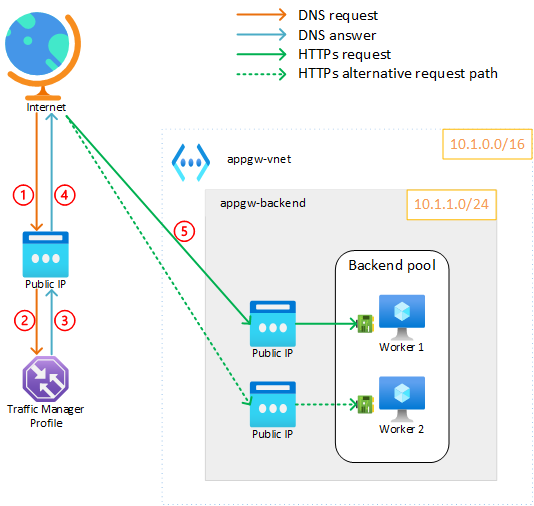

# Traffic Manager - simple HTTP backend

The goal of this quick lab setup is to deploy an Azure Traffic Manager with a simple HTTP backend displaying some data about the used worker (hostname, IP, etc).



## Deploy

This terraform template will deploy:

* 1 Azure Traffic Manager with a public frontend IP address
* `X` backend workers based on `web_workers_count` configuration (2 by default)
  * A public IP address for each worker

### Configure

Edit the `terraform.tfvars` file and set (at least) the following variables:

```tf
main_region       = "westeurope"
subscription_name = "to-be-changed"
subscription_id   = "to-be-changed
```

### Deploy

```bash
terraform init
terraform apply # approve
```

### See ouputs

```bash
terraform output
# Outputs:
testing_command = "curl -s http://traffic-manager-demo-profile.trafficmanager.net/api | python3 -m json.tool"
```

## Results

You should now be able to test the deployment by using the command provided in the output:

```bash
curl -s http://traffic-manager-demo-profile.trafficmanager.net/api | python3 -m json.tool
```

You should get an ouptut like this:

```json
{
    "architecture": "x86_64",
    "hostname": "web-2",
    "ip-address": "10.1.1.5",
    "mac-address": "bd:67:90:ff:f5:21",
    "platform": "Linux",
    "platform-release": "5.15.0-1017-azure",
    "platform-version": "#20-Ubuntu SMP Fri Aug 5 12:00:24 UTC 2022",
    "processor": "x86_64",
    "ram": "1 GB",
    "remote_addr": "xxx.xxx.xxx.xxx",
    "uptime": "211 seconds"
}
```

You can also check the health of the backend workers by running the following command:

```bash
az network traffic-manager endpoint list -g atm-test-RG --profile-name atm-profile --query "[].{name: name, endpointMonitorStatus: endpointMonitorStatus}"
```

You should get an ouptut like this:

```json
[
  {
    "endpointMonitorStatus": "Online",
    "name": "web-1"
  },
  {
    "endpointMonitorStatus": "Online",
    "name": "web-2"
  }
]
```

## Cleanup

```bash
terraform destroy
```
